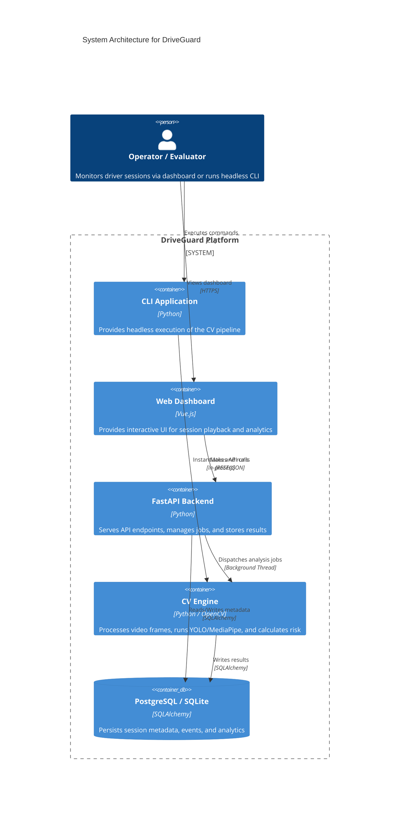

# DriveGuard System Architecture

```mermaid
C4Context
    title System Architecture for DriveGuard

    Person(user, "Operator / Evaluator", "Monitors driver sessions via dashboard or runs headless CLI")
    
    System_Boundary(driveguard, "DriveGuard Platform") {
        Container(cli, "CLI Application", "Python", "Provides headless execution of the CV pipeline")
        Container(frontend, "Web Dashboard", "Vue.js", "Provides interactive UI for session playback and analytics")
        
        Container(backend, "FastAPI Backend", "Python", "Serves API endpoints, manages jobs, and stores results")
        
        Container(cv_engine, "CV Engine", "Python / OpenCV", "Processes video frames, runs YOLO/MediaPipe, and calculates risk")
        
        ContainerDb(database, "PostgreSQL / SQLite", "SQLAlchemy", "Persists session metadata, events, and analytics")
    }

    Rel(user, frontend, "Views dashboard", "HTTPS")
    Rel(user, cli, "Executes commands", "CLI")
    
    Rel(frontend, backend, "Makes API calls", "REST/JSON")
    Rel(cli, cv_engine, "Instantiates and runs", "In-process")
    Rel(backend, cv_engine, "Dispatches analysis jobs", "Background Thread")
    
    Rel(cv_engine, database, "Writes results", "SQLAlchemy")
    Rel(backend, database, "Reads/Writes metadata", "SQLAlchemy")
```
