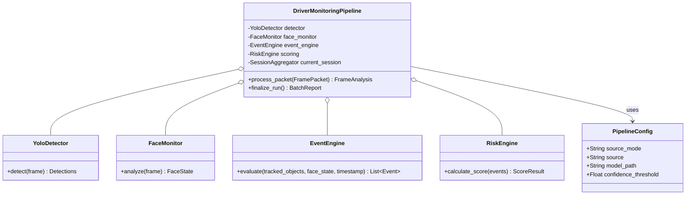

# Class Diagram

```mermaid
classDiagram
    class PipelineConfig {
        +String source_mode
        +String source
        +String model_path
        +Float confidence_threshold
    }

    class DriverMonitoringPipeline {
        -YoloDetector detector
        -FaceMonitor face_monitor
        -EventEngine event_engine
        -RiskEngine scoring
        -SessionAggregator current_session
        +process_packet(FramePacket) FrameAnalysis
        +finalize_run() BatchReport
    }

    class EventEngine {
        +evaluate(tracked_objects, face_state, timestamp) List~Event~
    }

    class RiskEngine {
        +calculate_score(events) ScoreResult
    }

    class YoloDetector {
        +detect(frame) Detections
    }

    class FaceMonitor {
        +analyze(frame) FaceState
    }

    DriverMonitoringPipeline o-- YoloDetector
    DriverMonitoringPipeline o-- FaceMonitor
    DriverMonitoringPipeline o-- EventEngine
    DriverMonitoringPipeline o-- RiskEngine
    DriverMonitoringPipeline --> PipelineConfig : uses
```
