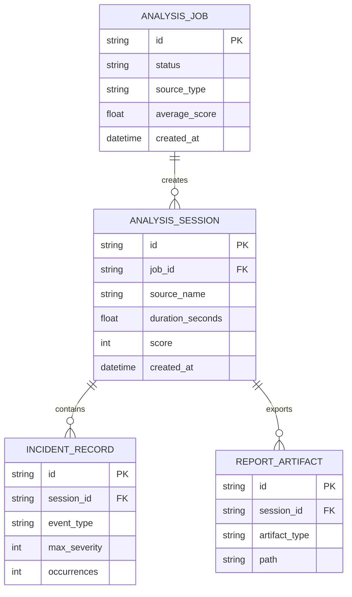

# Entity Relationship Diagram

```mermaid
erDiagram
    ANALYSIS_JOB ||--o{ ANALYSIS_SESSION : creates
    ANALYSIS_SESSION ||--o{ INCIDENT_RECORD : contains
    ANALYSIS_SESSION ||--o{ REPORT_ARTIFACT : exports

    ANALYSIS_JOB {
        string id PK
        string status
        string source_type
        float average_score
        datetime created_at
    }

    ANALYSIS_SESSION {
        string id PK
        string job_id FK
        string source_name
        float duration_seconds
        int score
        datetime created_at
    }

    INCIDENT_RECORD {
        string id PK
        string session_id FK
        string event_type
        int max_severity
        int occurrences
    }

    REPORT_ARTIFACT {
        string id PK
        string session_id FK
        string artifact_type
        string path
    }
```
