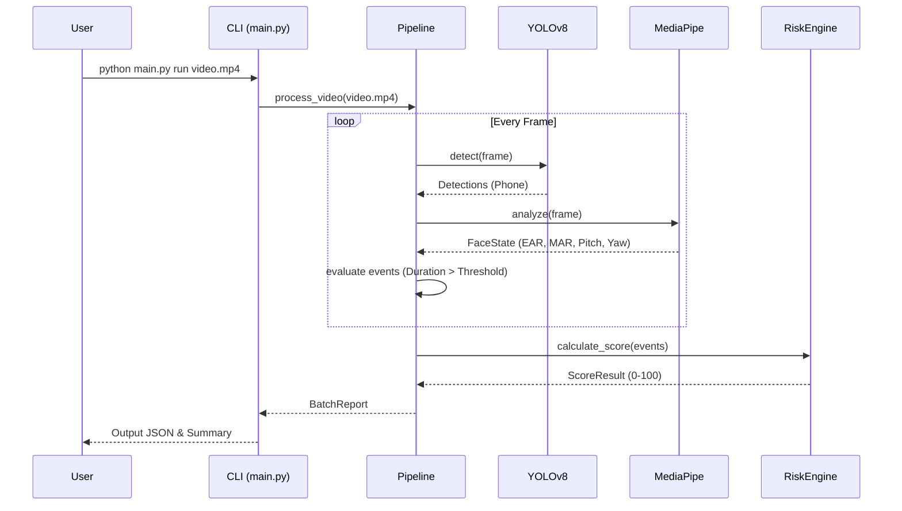

# Sequence Diagram

```mermaid
sequenceDiagram
    participant U as User
    participant CLI as CLI (main.py)
    participant Pipe as Pipeline
    participant Y as YOLOv8
    participant M as MediaPipe
    participant RE as RiskEngine

    U->>CLI: python main.py run video.mp4
    CLI->>Pipe: process_video(video.mp4)
    
    loop Every Frame
        Pipe->>Y: detect(frame)
        Y-->>Pipe: Detections (Phone)
        
        Pipe->>M: analyze(frame)
        M-->>Pipe: FaceState (EAR, MAR, Pitch, Yaw)
        
        Pipe->>Pipe: evaluate events (Duration > Threshold)
    end
    
    Pipe->>RE: calculate_score(events)
    RE-->>Pipe: ScoreResult (0-100)
    
    Pipe-->>CLI: BatchReport
    CLI-->>U: Output JSON & Summary
```
