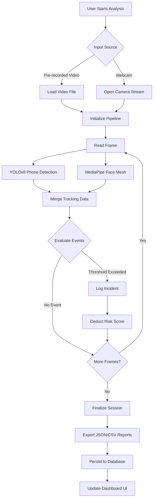

# DriveGuard End-to-End Workflow

```mermaid
flowchart TD
    Start[User Starts Analysis] --> Input{Input Source}
    
    Input --> |Pre-recorded Video| V[Load Video File]
    Input --> |Webcam| W[Open Camera Stream]
    
    V --> Init[Initialize Pipeline]
    W --> Init
    
    Init --> Read[Read Frame]
    
    Read --> Detect[YOLOv8 Phone Detection]
    Read --> Face[MediaPipe Face Mesh]
    
    Detect --> Merge[Merge Tracking Data]
    Face --> Merge
    
    Merge --> Eval{Evaluate Events}
    
    Eval --> |Threshold Exceeded| Log[Log Incident]
    Eval --> |No Event| Next{More Frames?}
    
    Log --> Penalty[Deduct Risk Score]
    Penalty --> Next
    
    Next --> |Yes| Read
    Next --> |No| End[Finalize Session]
    
    End --> Export[Export JSON/CSV Reports]
    Export --> DB[Persist to Database]
    DB --> UI[Update Dashboard UI]
```
