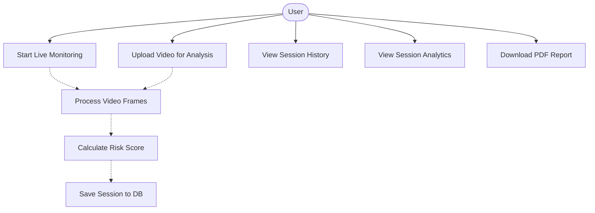
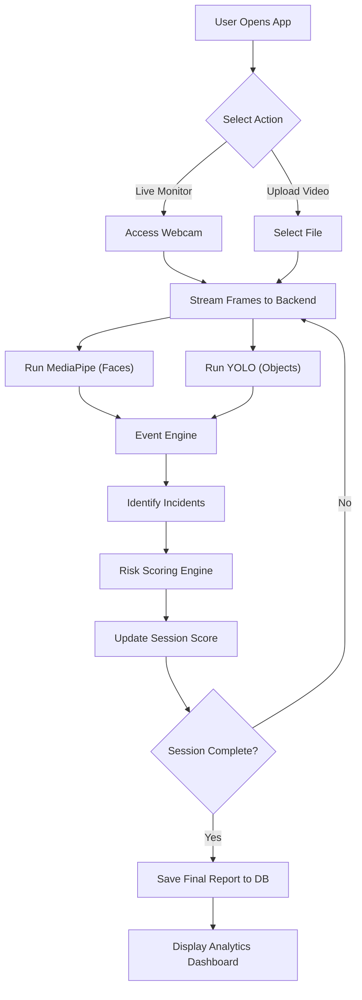
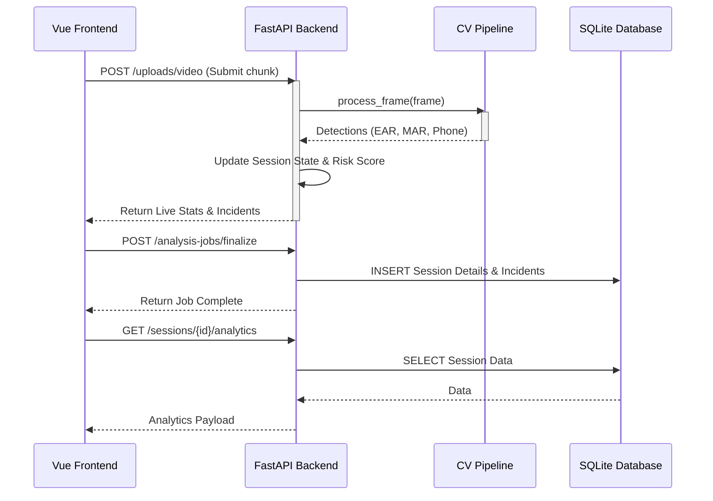
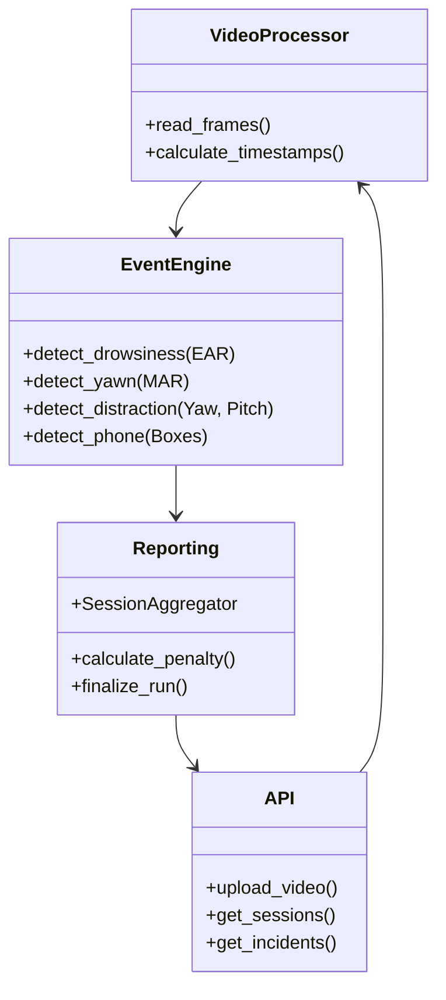
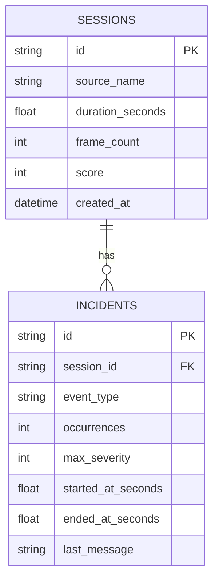
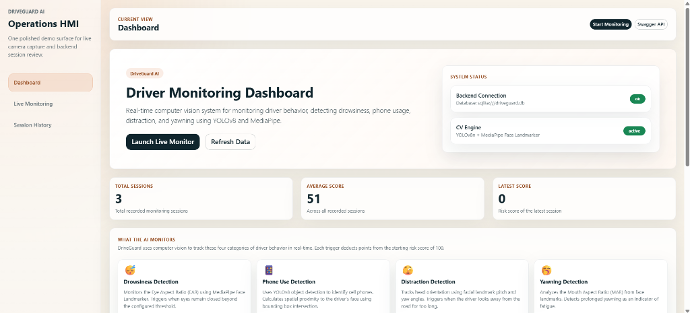
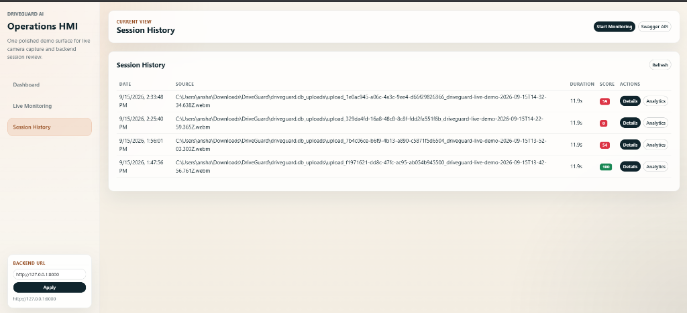
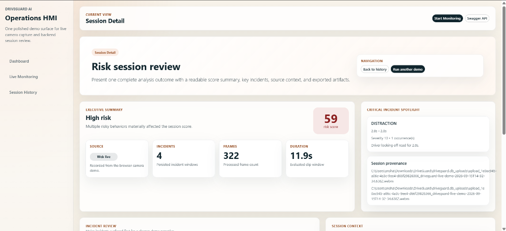

# 1. Cover Page

**Project Title:** DriveGuard AI — Driver Monitoring System
**Course:** Computer Vision (CSE3010)
**Student Name:** Ansh Arora
**Registration Number:** 24BAI10709

---

# 2. Introduction
DriveGuard AI is an advanced, real-time Driver Monitoring System (DMS) built to enhance road safety. By leveraging state-of-the-art computer vision models (YOLOv8 and MediaPipe), the system detects critical risky behaviors such as drowsiness, distraction, and phone usage. The project is implemented as a modern full-stack web application with a FastAPI backend and a Vue.js frontend, making it accessible through standard web cameras without requiring specialized hardware.

# 3. Problem Statement
Road traffic accidents caused by driver fatigue and distraction remain a significant global safety issue. While modern high-end vehicles often come equipped with Driver Monitoring Systems, these systems are expensive and unavailable to the vast majority of existing vehicles on the road. There is a critical need for an accessible, software-based solution that can be deployed using standard camera hardware to monitor driver alertness in real-time.

# 4. Functional Requirements
- **Live Video Capture:** The system must capture video from the user's webcam and process it in real-time.
- **Behavior Detection:** The system must accurately detect drowsiness (via Eye Aspect Ratio), yawning (via Mouth Aspect Ratio), distraction (via head pose yaw/pitch), and phone usage (via object detection).
- **Dynamic Risk Scoring:** The system must calculate and assign penalties based on the severity and duration of detected events, updating a live risk score (0-100).
- **Session Management:** The system must record sessions, allowing users to view a historical log of their drives.
- **Analytics Dashboard:** The system must provide a visual breakdown of incidents and score timelines for post-session review.
- **Report Generation:** The system must allow users to download a structured report of their session analytics.

# 5. Non-functional Requirements
1. **Performance:** The computer vision pipeline must process frames efficiently to maintain a responsive real-time analysis loop (aiming for >15 FPS on standard CPUs).
2. **Reliability:** The system must accurately handle variable lighting conditions and different user demographics by using robust ML models.
3. **Usability:** The web interface must be intuitive, responsive, and provide clear visual feedback (e.g., color-coded risk levels) to the user.
4. **Maintainability:** The codebase must be highly modular, separating the frontend UI, backend API, and core computer vision engines to allow for easy updates and model swapping.
5. **Data Privacy:** Video frames must be processed locally without being permanently stored or sent to external third-party cloud APIs.

# 6. System Architecture
DriveGuard follows a client-server architecture. The frontend (Vue.js) handles UI rendering and video capture, sending data to the backend (FastAPI). The backend orchestrates the Computer Vision Engine (OpenCV, YOLO, MediaPipe), processes the frames, updates the SQLite database, and returns the analysis results.

# 7. Design Diagrams

### 7.1 Use Case Diagram

### 7.2 Workflow Diagram

### 7.3 Sequence Diagram

### 7.4 Class / Component Diagram

### 7.5 ER Diagram

# 8. Design Decisions & Rationale
- **FastAPI over Flask/Django:** Chosen for its high performance, native async support (crucial for I/O and video processing), and automatic Swagger documentation.
- **Vue.js + Vite:** Selected for its reactivity model and component-based architecture, which makes building dynamic dashboards (like the live monitoring view) highly efficient.
- **SQLite Database:** Used for zero-configuration local persistence, ensuring the project is easy to run and evaluate without requiring a dedicated database server setup.
- **MediaPipe over dlib:** MediaPipe provides robust, hardware-accelerated face landmarking that runs efficiently on standard CPUs, whereas dlib requires heavy compilation and performs poorly without a GPU.
- **YOLOv8:** Utilized for object detection (phones) due to its industry-leading speed-to-accuracy ratio.

# 9. Implementation Details
The project is divided into three main modules:
1. **CV Engine (`cv_engine/`):** Contains the core logic. `pipeline.py` orchestrates the flow. `event_engine.py` calculates EAR/MAR logic. `reporting.py` maintains state during the video feed and calculates the final risk score.
2. **Backend API (`backend/`):** Built with FastAPI and SQLAlchemy. Exposes REST endpoints to receive video uploads, trigger analysis jobs, and fetch historical session data.
3. **Frontend SPA (`frontend/`):** A Vue 3 application built with Vite. Uses Chart.js for data visualization on the Analytics page and handles webcam interactions via the browser's MediaRecorder API.

# 10. Screenshots / Results
*(These are the visual demonstrations of the real-time application in action)*

### 10.1 Operations Dashboard

### 10.2 Live Camera Monitoring

### 10.3 Session History

### 10.4 Analytics & Reporting

### 10.5 Session Details

# 11. Testing Approach
- **Unit Testing:** `pytest` is used to test the core logic of the `cv_engine`, particularly the `reporting.py` (SessionAggregator) to ensure risk scores and penalties are calculated correctly under various scenarios.
- **API Testing:** Tests are written using FastAPI's `TestClient` to verify the CRUD operations of the `/sessions` and `/incidents` endpoints.
- **Manual Validation:** The live monitoring interface was manually validated under different lighting conditions and angles to ensure the MediaPipe and YOLO models triggered correctly.

# 12. Challenges Faced
- **Browser Video Timestamps:** WebM files generated by the browser's `MediaRecorder` often report 1000+ FPS natively, which broke the duration calculations. *Solution:* Rewrote the video processor to rely on OpenCV's container-level millisecond timestamps (`CAP_PROP_POS_MSEC`) instead of frame counts.
- **State Management:** Tracking continuous events (like a 3-second yawn) across discrete frames required building a robust state-machine (`EventEngine`) that could handle intermittent detection drops.

# 13. Learnings & Key Takeaways
- Gained deep practical experience in building and orchestrating real-time computer vision pipelines.
- Learned how to bridge asynchronous web frameworks (FastAPI) with synchronous, CPU-intensive ML tasks.
- Improved skills in responsive frontend design and data visualization using Vue.js and Chart.js.

# 14. Future Enhancements
- Implement a more complex risk model using deep learning (e.g., LSTMs) to analyze temporal sequences of behavior rather than hardcoded heuristics.
- Add support for comparing two different driving sessions side-by-side.
- Integrate cloud storage for backing up video clips associated with critical incidents.

# 15. References
- OpenCV Documentation: https://docs.opencv.org/
- MediaPipe Face Landmarker: https://developers.google.com/mediapipe
- Ultralytics YOLOv8: https://docs.ultralytics.com/
- FastAPI Framework: https://fastapi.tiangolo.com/
- Vue.js Documentation: https://vuejs.org/
